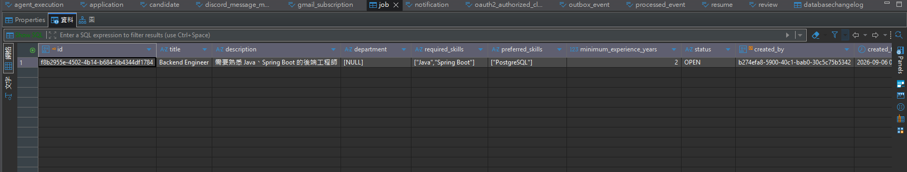
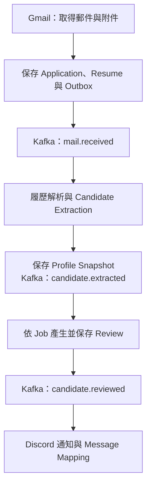

# AI Recruitment Assistant

以 Gmail 應徵郵件為起點，解析履歷、依職缺進行 AI 審閱，並將所有完成的審閱結果傳送至 Discord，協助 HR 判斷候選人。

## 專案目的

這個專案主要是與 AI 協作，將自己想開發的想法先做成 POC 進行驗證，同時嘗試一些目前只有初步了解，或過去較少實際使用的技術。

初期在選擇技術棧時，我對 Kafka 只有很初步的了解。當時主要考量 Gmail 取得履歷後，後續 AI 解析與審閱流程可能比較耗時，因此希望透過事件驅動的方式，讓後續流程可以依照各自的處理能力逐步消化，避免上游流程被 AI 處理速度綁住，並預計搭配消費端的併發與速率控制，降低短時間大量呼叫外部 API 的可能性，以及不同系統、功能邊界之間的耦合。

對於 WebFlux、Reactor，我已有基本的訂閱與非同步處理概念，也知道 WebFlux 大致可以處理 Spring MVC 常見的 Web 開發需求，但還沒有深入的實務經驗。

因此這個專案除了驗證想法之外，後續也希望針對實際使用到的技術逐步深入了解，再回頭檢視 AI 產生的初版實作，針對不合理或可以改善的地方進行重構與調整。

目前已發現或預計調整的項目例如：

1. 初期 SPEC 對 DB Migration 的技術選型描述不夠明確，因此 AI 初版使用 Flyway；後續檢視後改為自己較熟悉的 Liquibase。

2. 目前部分資料存取使用較多手寫 SQL，後續預計重新檢視 Persistence Layer，評估將適合的部分改用 Spring Data R2DBC 的 Repository API，並保留複雜查詢所需的 SQL。另外也會加強系統 Log，目前以 Happy Path 為例，從 Gmail 標記郵件到 Discord 成功收到訊息，Console 幾乎沒有 INFO 層級的流程紀錄，對第一次閱讀、除錯或後續維護專案的人來說，會比較難快速了解一次完整流程實際經過哪些階段。

3. AI 方面，後續預計進一步了解 Spring AI 提供的相關功能與抽象，例如 Advisor API，並重新檢視目前的 AI 呼叫流程，評估是否適合透過 Advisor 整合共用的處理邏輯，改善程式結構與維護性。例如 Spring AI 2.0 提供的 StructuredOutputValidationAdvisor，後續會進一步了解其結構化輸出驗證與相關處理機制，並評估是否適合應用於目前的履歷解析與審閱流程。

4. 目前也有進行容器化，希望讓本機環境建置更單純，並為後續部署至雲端環境做準備。不過現階段對容器、Kafka、WebFlux 等技術，大多還是先理解基本概念後就撰寫 SPEC 進行 POC，因此目前的架構與實作不一定是最佳解，也可能有一些初期沒有考量到的問題。後續會隨著對各項技術理解加深，再逐步檢視與調整。

## Demo 執行成果

### Gmail 郵件標籤


### 職缺與審閱條件


### Discord 審閱通知


### 測試履歷

為避免測試用手機號碼碰巧對應真實號碼，上傳前已將號碼遮蔽。

- [履歷範例 8](demo/resume8.pdf)
- [履歷範例 9](demo/resume9.pdf)
- [履歷範例 10](demo/resume10.pdf)

----------------
以下由 AI 依專案實作協助整理
----------------

## 功能與流程

- Google OAuth2 登入與 Gmail readonly 授權。
- 建立職缺，設定個人的 Gmail 搜尋條件及對應職缺。
- 定期下載履歷，支援文字型 PDF、DOC、DOCX、TXT。
- 抽取 Candidate Profile，保存每次應徵的資料快照。
- 依 JD、必要／加分技能、最低年資產生 Review。
- 將所有完成的審閱結果送至 Discord，包含 NOT_RECOMMENDED；不以分數或推薦等級過濾，由 HR 判斷。
- 保存審閱版本、Agent 執行紀錄、通知狀態及訊息關聯。



Application 的 RECEIVED、EXTRACTED、REVIEWED、PROCESSING_FAILED 代表處理進度。AI 評分與推薦供 HR 參考，最終招募決策由 HR 負責。

## 技術分工

| 技術 | 用途 |
|---|---|
| Java 21、Spring Boot 4.1.1 | Modular Monolith 後端 |
| WebFlux、WebClient、R2DBC | Reactive API、外部 HTTP 與 PostgreSQL 業務存取 |
| Spring AI 2.0.1、Ollama | 履歷理解、結構化輸出與職缺審閱 |
| Apache Tika 3.3.2 | PDF／Word 文字解析 |
| PostgreSQL | 業務資料、Token 密文、事件與執行紀錄 |
| Kafka | 讓郵件取得、抽取、審閱、通知分階段接續處理 |
| Transactional Outbox、processed_event | 保留待發布事件、避免同一事件重複提交結果 |
| Liquibase starter | 資料庫 schema 版本管理 |
| Discord Bot API | 審閱結果訊息發送 |
| 本機檔案儲存 | 保存原始履歷附件 |

Kafka 事件傳送關聯 ID，Consumer 再讀取資料庫或檔案。Gmail 保存郵件後，不必等待 AI 與 Discord 全部完成。Outbox 將業務資料與待發事件放在同一交易，Publisher 再送至 Kafka；Consumer 依事件 ID 去重。

## 設定來源：職缺條件與 YAML 的差別

| 內容 | 來源 |
|---|---|
| 正式審閱條件：JD、必要／加分技能、最低年資 | POST /api/jobs 建立後保存於 PostgreSQL |
| 正式 Gmail 排程的 query 與職缺綁定 | PUT /api/gmail/subscription 保存於 PostgreSQL |
| 手動 GET /api/gmail/messages 的 query | application.yml 的 app.gmail.query／GMAIL_QUERY |
| 連線、模型、排程週期、功能開關 | application.yml／環境變數 |
| AI 的抽取與審閱政策 | src/main/resources/prompts/*.txt |
| 手動 Demo 的 JD | 當次 POST /api/demo/review 的 jobDescription |

AgentDemoController 是手動測試入口，不是 HR 保存篩選條件的入口。

## 本機啟動

### 1. 準備環境變數

使用 Java 21 與 Docker Compose。參考 [.env.example](.env.example)，在 IDE Run Configuration 或啟動 Spring Boot 的 shell 設定：

| 環境變數 | 用途 |
|---|---|
| GOOGLE_CLIENT_ID、GOOGLE_CLIENT_SECRET | Google OAuth Client |
| TOKEN_ENCRYPTION_KEY | Base64 編碼的 32-byte 隨機 AES 金鑰；重啟後保持相同 |
| OLLAMA_MODEL | 預設 qwen3:8b |
| GMAIL_ENABLED | 初次設定可明確設 false，完成 Subscription 後改 true |
| GMAIL_POLL_CRON | 預設每五分鐘：0 */5 * * * * |
| DISCORD_ENABLED | 初次設定可明確設 false，完成 Bot 設定後改 true |
| DISCORD_BOT_TOKEN、DISCORD_CHANNEL_ID | Discord 發送授權與文字頻道 ID |
| RESUME_STORAGE_DIR | 預設 ./data/resumes |

**Spring Boot 不會自動讀取專案的 .env。** 單純複製檔案不會把值送進主機上的 Java 程序；請在 IDE 或 shell 載入。

目前 application.yml 的 GMAIL_ENABLED、DISCORD_ENABLED 預設為 true，.env.example 則示範 false。若先不測 Discord，需明確傳入 DISCORD_ENABLED=false，否則啟動時會檢查 Token 與頻道 ID。

Token 加密金鑰請安全保存。若更換金鑰，既有密文無法用新金鑰直接解密。

### 2. 啟動基礎服務

```bash
docker compose up -d postgres kafka ollama
docker compose exec ollama ollama pull qwen3:8b
```

Compose 使用 PostgreSQL 5432、Kafka 9092、Ollama 11434；請避免與既有服務占用相同 port。

Ollama 的 Compose 設定包含 gpus: all，需要 Docker GPU 支援。使用 CPU 執行時，可先移除該設定；若已有主機上的 Ollama，則只啟動 postgres、kafka，並確認模型已下載。

### 3. 設定 Google OAuth 並啟動後端

Google OAuth Client 的 Authorized redirect URI 設為：

```text
http://localhost:8080/login/oauth2/code/google
```

確認 Google 專案已啟用 Gmail API，並將登入帳號加入 OAuth 測試使用者（若同意畫面使用測試模式）。

Windows PowerShell：

```powershell
.\mvnw.cmd spring-boot:run
```

macOS／Linux：

```bash
./mvnw spring-boot:run
```

啟動後開啟 [Google 登入入口](http://localhost:8080/oauth2/authorization/google)。

### 4. 建立職缺與 Gmail Subscription

登入後，在同一個 localhost:8080 網站的瀏覽器 Console 執行。建立 Job 每次會新增一筆，請按需求修改內容：

```javascript
const csrfResponse = await fetch('/api/csrf');
if (!csrfResponse.ok) throw new Error('Get CSRF token failed');
const csrf = await csrfResponse.json();
const headers = {
  'Content-Type': 'application/json',
  [csrf.headerName]: csrf.token
};

const jobResponse = await fetch('/api/jobs', {
  method: 'POST',
  headers,
  body: JSON.stringify({
    title: 'Backend Engineer',
    description: 'Java / Spring Boot backend development',
    requiredSkills: ['Java', 'Spring Boot'],
    preferredSkills: ['PostgreSQL', 'Kafka'],
    minimumExperienceYears: 2
  })
});
if (!jobResponse.ok) throw new Error('Create job failed');
const job = await jobResponse.json();

const subscriptionResponse = await fetch('/api/gmail/subscription', {
  method: 'PUT',
  headers,
  body: JSON.stringify({
    jobId: job.id,
    query: 'label:applications has:attachment',
    enabled: true
  })
});
if (!subscriptionResponse.ok) throw new Error('Save subscription failed');
```

正式排程使用這筆 Subscription 的 query。每個 HR 一組 Subscription，對應自己的一個 OPEN Job。

### 5. 執行完整流程

1. 設定 GMAIL_ENABLED=true；環境設定變更後重啟後端。
2. 寄一封附有支援格式履歷的郵件至已授權的 Gmail。
3. 在 Gmail 套用 applications Label，讓信件符合上述 query。
4. 等待排程，查詢 GET /api/applications。
5. 使用 Application ID 查詢 GET /api/applications/{id}/reviews。

正常處理狀態為 RECEIVED → EXTRACTED → REVIEWED。若顯示 PROCESSING_FAILED，可查看 failure_code 與 agent_execution。

相同 Gmail message ID 只建立一次應徵；再次測試請使用新郵件。系統以入庫資料去重，不需要移除 Gmail Label。

### 6. 啟用 Discord

將 Bot 安裝到目標伺服器，確認它對文字頻道有 View Channel／Send Messages 權限，設定：

```text
DISCORD_ENABLED=true
DISCORD_BOT_TOKEN=你的BotToken
DISCORD_CHANNEL_ID=目標文字頻道ID
```

Token 填原值，不加 Bot 前綴。重啟後，審閱通知事件由 Discord Consumer 接手。第一次啟用可能會處理 Kafka 保留期限內累積的通知事件。

成功通知會保存 notification.status=SENT 及 discord_message_mapping。

## HTTP API

所有 /api/** 需要 Google 登入 Session。POST／PUT 需要 CSRF Header；以 GET /api/csrf 回傳的 headerName、token 為準。

| Method | Path | 用途 |
|---|---|---|
| GET | /api/csrf | 取得 Session 的 CSRF Token |
| POST | /api/jobs | 建立目前 HR 的 OPEN Job，回傳 201 |
| GET | /api/jobs | 列出目前 HR 的職缺 |
| GET | /api/gmail/messages | 依全域預設 query 查信件 ID，不觸發 ingestion |
| PUT | /api/gmail/subscription | 設定個人 query、職缺及啟用狀態，回傳 204 |
| GET | /api/gmail/subscription | 查看個人設定 |
| GET | /api/applications | 最近 100 筆自己的應徵 |
| GET | /api/applications/{id} | 應徵狀態及 candidate_profile_json |
| GET | /api/applications/{id}/reviews | 審閱版本與通知狀態 |
| POST | /api/demo/review | 手動執行兩段 Agent，回傳 candidate、review |

Demo request：

```json
{
  "jobDescription": "需要 Java 與 Spring Boot 後端開發經驗",
  "mailSubject": "應徵後端工程師",
  "mailBody": "附件為履歷",
  "resumeContent": "三年 Java、Spring Boot、PostgreSQL 開發經驗"
}
```

Demo 不建立正式 Application／Review 或發送通知，但會保存 Agent Execution。正式 API 中的 candidate_profile_json、技能清單等 JSON TEXT 欄位會以字串回傳。

## 資料與 Schema

- 原始附件保存於本機；PostgreSQL 保存 metadata、storage reference 與解析文字。
- 支援文字型 PDF、DOC、DOCX、TXT；掃描文件需要可解析文字。
- 每郵件最多 10 個具名附件，單檔上限 10 MiB，宣告附件總量上限 20 MiB。
- 單檔解析文字上限 100,000 字元，合併上限 150,000 字元。
- 同一正規化 Email 重用 Candidate ID；每次 Application 保存獨立 Profile Snapshot。

Liquibase 使用獨立 JDBC URL，業務存取使用 R2DBC。

主 changelog 為 [db.changelog-master.xml](src/main/resources/db/changelog/db.changelog-master.xml)，直接組合兩個 Liquibase XML changeset：

- 001-initial-schema：核心業務、授權、Outbox 與 Agent 表。
- 002-pipeline：Profile Snapshot、Outbox 租約、通知、Subscription 與索引。

表格、欄位與一般索引使用 createTable、addColumn、createIndex 等 Liquibase change type。
PostgreSQL 的分數 CHECK 與非空 Email 部分函式索引，以 changeset 內的 sql 表達。

## 逾時設定

| 設定 | 預設 | 用途 |
|---|---|---|
| AGENT_TIMEOUT | 10m | 單次 Agent 工作等待上限 |
| WORKFLOW_TIMEOUT | 12m | Extraction／Review Kafka Listener 等待上限 |
| KAFKA_MAX_POLL_INTERVAL_MS | 900000（15 分鐘） | Kafka 兩次 poll 的允許間隔 |

外層等待時間涵蓋模型執行並保留資料庫處理餘裕。啟動時會檢查 workflow 大於 agent，
且 Kafka poll 間隔大於 workflow 加一分鐘。調整模型等待時間時，需一起調整外層設定。
同步模型呼叫在 reactive timeout 後仍可能需要時間才停止。

## 事件與處理紀錄

- mail.received：觸發抽取。
- candidate.extracted：抽取完成後觸發審閱。
- candidate.review.requested：可額外要求 Review Consumer 建立新的審閱。
- candidate.reviewed：保存審閱後發布，Discord Consumer 接收所有完成的審閱結果並通知 HR。

Outbox 發布失敗採退避，第 8 次失敗標記 FAILED。Kafka Consumer 的一般錯誤最多重試 4 次後進 DLQ；Consumer 收到 PermanentFailure 直接進 DLQ。Ingestion 階段的 PermanentFailure 則保存失敗 Application。

processed_event 與業務寫入位於同一交易；重複事件可能再次呼叫模型，但不重複提交同一事件的業務結果。

Discord 使用 PENDING → SENDING → SENT 追蹤通知。UNKNOWN 或停留在 SENDING 的通知需先核對頻道，不會直接自動補發。Notifier 保留 WebClientResponseException 狀態；429 回到 PENDING 並交由 Kafka 退避重試，重試耗盡則進 DLQ。其他無法確認送達的錯誤保留 UNKNOWN。

Agent 執行資訊保存於 agent_execution。Prompt 資源檔及 Prompt version 用於追查抽取與審閱行為。

Discord 訊息標題為「Candidate Review」，保留分數、推薦等級、符合技能、缺少技能與審閱理由，供 HR 決策參考。若歷史審閱事件已超過 Kafka 保留期限，需要另行發布 candidate.review.requested 事件，才能產生新版本與通知。目前未提供重新審閱的 HTTP API。

Discord Consumer 訂閱 candidate.reviewed，通知處理發生不可重試錯誤或重試耗盡時，事件進入 candidate.reviewed.dlq，不會將已完成審閱的 Application 改為 PROCESSING_FAILED。切換 topic 後，依目前 earliest 設定，首次訂閱會讀取 Kafka 保留的歷史審閱事件；已 SENT 的 review 不會重複發送，尚未通知的歷史結果可能補送。舊通知 topic 與其中待處理事件不會自動搬移或刪除，上線前需核對舊事件與 Outbox 待發布紀錄。

## 架構決策

- [ADR 0001：WebFlux 與 R2DBC](docs/adr/0001-webflux-and-r2dbc.md)
- [ADR 0002：AI 為決策支援](docs/adr/0002-human-in-the-loop.md)

## 學習目標與後續規劃

本專案除了實作 AI 招募輔助流程，也是探索 Event-Driven Architecture、Reactive Programming 與 LLM 應用開發的實作專案。

開發採取 **Learning by Building**：先建立可運作的端到端流程，再透過可靠性、併發與錯誤處理問題，理解技術原理及設計取捨。

| 領域              | 目前實作                                             | 後續重點                                            |
| --------------- | ------------------------------------------------ | ----------------------------------------------- |
| Kafka           | 事件串接、Consumer Group、Retry、DLQ                    | Partition、Offset Commit、Rebalance、順序與重複投遞       |
| Reactor／WebFlux | `Mono`／`Flux`、R2DBC、透過 `boundedElastic` 隔離部分阻塞操作 | Backpressure、執行緒模型、取消與逾時、併發及錯誤傳遞                |
| 資料一致性           | Transactional Outbox、事件處理紀錄、通知狀態追蹤               | 驗證當機、重複事件與並行處理下的交易邊界及恢復行為                       |
| 整合測試            | —                                                | 評估使用 Testcontainers 驗證 PostgreSQL／Kafka 流程與失敗情境 |
| 可觀測性            | Agent Execution、事件識別資訊與處理狀態                      | 結構化日誌、跨元件追蹤、Consumer Lag、Outbox 積壓與 Agent 延遲    |

可靠性驗證將優先涵蓋：

* 同一事件重複投遞時，是否產生重複資料或通知。
* 業務資料與 Outbox 已提交後，Kafka 發布失敗時能否恢復。
* Discord 已送出、通知狀態尚未保存時，如何核對與處理。
* LLM 逾時或 Consumer 處理失敗／中斷後，如何追蹤並重新處理。

目標是透過可執行的系統，逐步補齊可靠性驗證、測試與可觀測性，並能解釋每個設計選擇的用途與限制。
